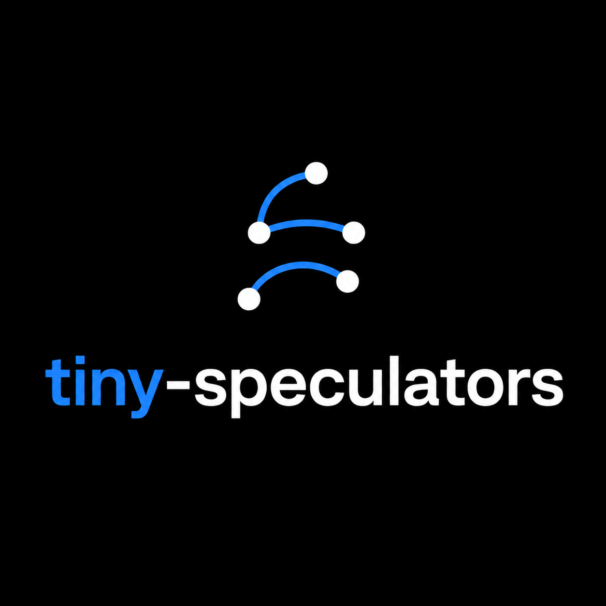

<div align="center">
  

  <h1>tiny-speculators</h1>

  <p><strong>A minimal repository for training speculative decoding models from scratch.</strong></p>

  <p>
    
    
    
    
    
  </p>
</div>

---

**tiny-speculators** is a minimal training repository currently supporting EAGLE-3 (Qwen3-8B), which includes the vLLM integration required to train and export a usable draft model.

## EAGLE-3 Draft Model Architecture

First of all, what is a EAGLE Draft Model?


## Training-Time Test


Another important method introduced in the paper is TTT(Training-Time Test) where for each token position, three verifier layers are concatenated and projected into the draft state.

## Quick start

Install the dependencies:

```bash
uv sync --group dev
uv pip install vllm==0.25.1
```

Each stage can be run independently. To run the full pipeline:

```bash
uv run python -m tiny_speculators.pipeline --max-samples <num_max_samples>
```

What `pipeline.py` does:

1. prepares data
2. generates verifier hidden states
3. trains the draft
4. exports it to vLLM's checkpoint format
5. verifies that vLLM uses the draft model

### Resuming

To resume a checkpoint after epoch two and train through epoch five:

```bash
uv run python -m tiny_speculators.scripts.train_eagle3 \
  --resume checkpoints/eagle3 \
  --output checkpoints/eagle3 \
  --epochs 5
```

or use pipeline script. 

It reuses the existing data artifacts,
continues training, exports the checkpoint, and runs the demo:

```bash
uv run python -m tiny_speculators.pipeline \
  --resume checkpoints/eagle3 \
  --epochs 5
```

## Future Works

- [x] EAGLE-3
- [ ] In-depth article on training EAGLE-3 from scratch
- [ ] EAGLE-3.1
- [ ] DFlash
- [ ] DSpark
