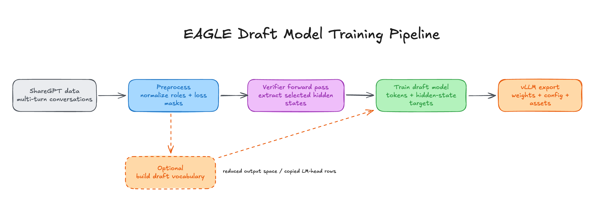
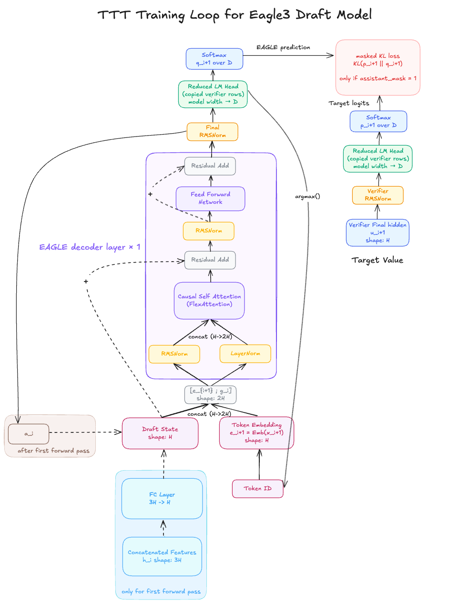
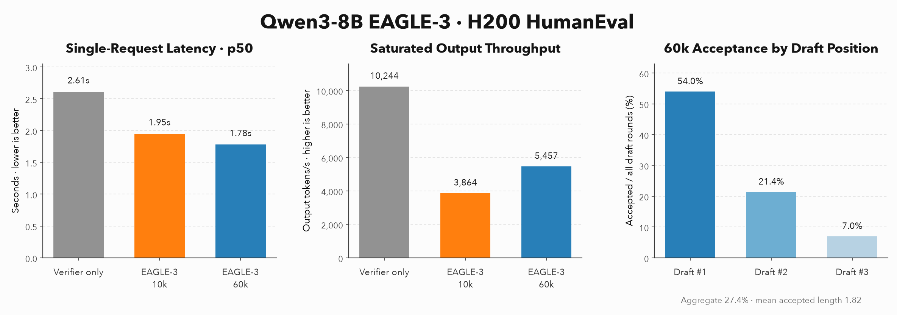

<div align="center">
  

  <h1>tiny-speculators</h1>

  <p><strong>A from-scratch implementation of speculative decoding model training.</strong></p>
    <p>
    
    
    
    
    
  </p>
</div>

## Overview

**tiny-speculators** is a compact, from-scratch implementation for training speculative decoding models such as EAGLE-3. It covers the full pipeline ranging from dataset preparation to vLLM-compatible checkpoint export.

## End-to-End Process



The full sequence is orchestrated by
[`pipeline.py`](tiny_speculators/scripts/pipeline.py).

1. **Prepare data:** apply the Qwen3 chat template, tokenize each conversation, and prepare loss masks.
   See: [`prepare_data.py`](tiny_speculators/scripts/prepare_data.py)
2. **Build the draft vocabulary:** select frequently used target tokens and
   create mappings between the smaller draft vocabulary and the verifier.
   See: [`vocab_mapping.py`](tiny_speculators/scripts/vocab_mapping.py),
   [`vocab.py`](tiny_speculators/eagle3/vocab.py)
3. **Extract hidden states:** run the frozen verifier with vLLM and save its
   early, middle, late, and final-layer states for each sample.
   See: [`generate_hidden_states.py`](tiny_speculators/scripts/generate_hidden_states.py)
4. **Train the draft:** fuse the first three states, run the three-step TTT
   rollout, and distill the verifier's token distribution into the draft.
   See: [`train_eagle3.py`](tiny_speculators/scripts/train_eagle3.py),
   [`model.py`](tiny_speculators/eagle3/model.py),
   [`attention.py`](tiny_speculators/eagle3/attention.py)
5. **Export:** convert the checkpoint to vLLM's Speculators format.
   See: [`export_vllm.py`](tiny_speculators/scripts/export_vllm.py)


## EAGLE-3 Draft Model Architecture

Speculative decoding pairs a small **draft model** with the original **verifier (target) model**. The draft proposes several future tokens cheaply, and the verifier checks them in parallel, accepting correct proposals and replacing the rest.

**[EAGLE-3](https://arxiv.org/abs/2503.01840)** is a draft-model architecture that predicts tokens directly from the current token and hidden states collected from early, middle, and late layers of the frozen verifier. This multi-layer feature fusion gives the small, single-layer draft richer context while keeping drafting inexpensive.


To explain it in more detail, **for each token position in a document**, the model takes the previous step’s hidden states from three verifier layers—early, middle, and late—along with the verifier’s final hidden state.

The three intermediate hidden states are concatenated and projected into the draft state ($3H \rightarrow H$). Meanwhile, the verifier’s final hidden state is passed through the LM head to produce logits, from which a token ID is selected.

The resulting token embedding is concatenated with the projected draft state and passed into the draft model’s decoder.

The decoder follows the structure shown above - RMSNorm/LayerNorm → Attention (more explained below) → residual connection → RMSNorm → FFN → residual connection.

In EAGLE-3, we pass through a **single** decoder layer at each draft step. Finally, the output goes through RMSNorm and the LM head to produce logits. Softmax converts these logits into the probability distribution used to select the next draft token.

Check [`eagle3/model.py`](tiny_speculators/eagle3/model.py) to see this in actual code.

## Training-Time Test



Another important technique introduced in the paper is Training-Time Test (TTT).

During training, instead of learning only one-step next-token prediction, **the draft model feeds its own predicted token back as the input for the next step** and learns across several consecutive draft steps.

This mirrors the autoregressive conditions encountered during inference and helps the model remain accurate even after making an imperfect prediction. This repository uses three TTT steps (`ttt_steps=3`) by default.

## FlexAttention

TTT requires a custom attention pattern instead of standard causal mask. Since each assistant's token position in a document is rolled out for `ttt_steps`, the KV cache contains `ttt_steps` times as many states. Also, each query must attend only to the relevant context: causal tokens from the same packed document and its matching _anchor_ across TTT steps.

[**PyTorch FlexAttention**](https://docs.pytorch.org/docs/stable/nn.attention.flex_attention.html) lets to express this pattern as a block-sparse `BlockMask` without materializing a full dense attention mask.

`create_ttt_block_mask()` isolates packed documents, preserves causal attention within each document, and allows each token to attend to its matching anchor across TTT steps.

See [`eagle3/attention.py`](tiny_speculators/eagle3/attention.py) for the implementation.

## Notes on training and performance

I trained [10k](https://huggingface.co/junuxyz/Qwen3-8B-speculator.eagle3-10k) and [60k](https://huggingface.co/junuxyz/Qwen3-8B-speculator.eagle3-60k) checkpoints from ShareGPT subsets on a single NVIDIA H200 using [Modal](https://modal.com/).

<p align="center">
  
  <br />
  <sub>H200 HumanEval latency, saturated throughput, and 60k draft acceptance.</sub>
</p>

On HumanEval dataset, the EAGLE-3 60k checkpoint accepted **27.4%** of proposed draft tokens (mean accepted length **1.82**) and reduced single-request p50 latency from **2.61s to 1.78s**. On saturated output case (many requests) throughput remained below verifier-only serving.

## Quick start

Create a fresh environment and install the dependencies:

```bash
uv venv --python 3.12 --seed
source .venv/bin/activate
uv pip install vllm==0.25.1 --torch-backend=auto
uv pip install -e .
```

Run the full pipeline:

```bash
python -m tiny_speculators.scripts.pipeline \
  --max-samples <num_max_samples>
```

This runs the full pipeline - prepare ShareGPT dataset, extract verifier hidden states, train the draft, and export a vLLM-compatible checkpoint.


## Future Works

- [x] [EAGLE-3](https://arxiv.org/abs/2503.01840)
- [ ] (Maybe) In-depth article on training EAGLE-3 from scratch
- [ ] [DFlash](https://arxiv.org/abs/2602.06036)
- [ ] [DSpark](https://deepseek.ai/blog/deepseek-dspark-speculative-decoding)
